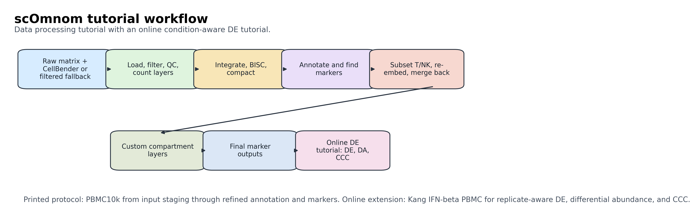
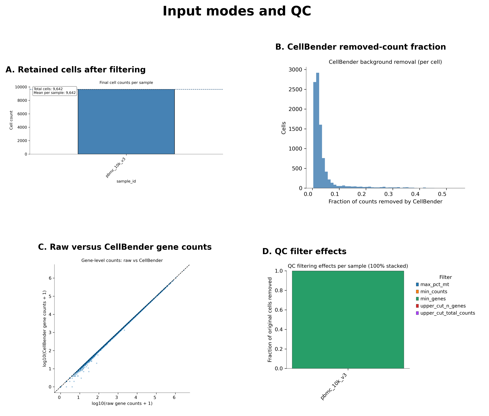
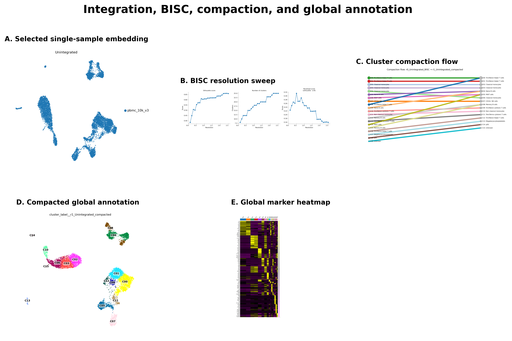
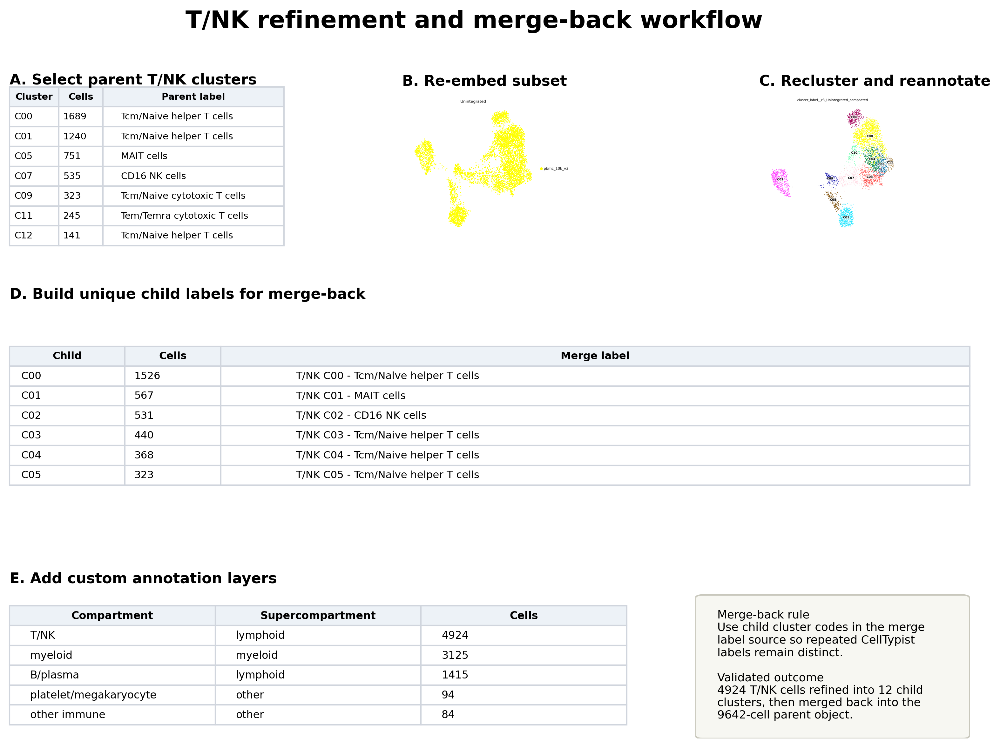
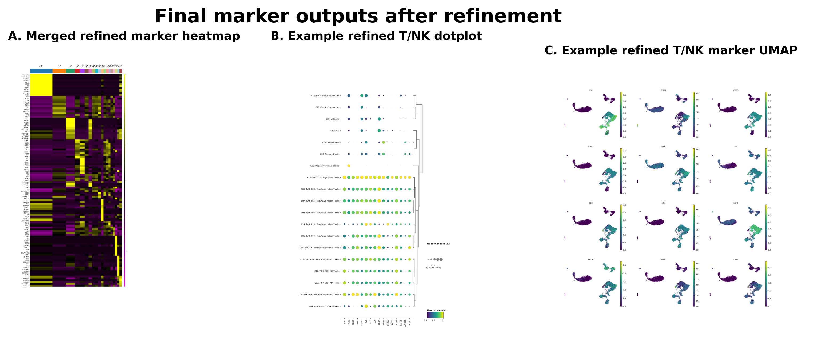

# PBMC10k Data Processing Tutorial

This tutorial processes a compact 10x Genomics PBMC10k single-cell RNA-seq dataset with scOmnom. The preferred path uses raw Cell Ranger counts plus matched CellBender-denoised counts. A filtered Cell Ranger fallback path is included for users without CellBender output or GPU access.

Condition-aware DE, DA, and CCC are not part of this PBMC10k tutorial because PBMC10k is a single-sample dataset. Continue to the [Kang IFN-beta PBMC DE tutorial](kang-ifnb-de.md) for replicate-aware analyses.

## Workflow Overview

The tutorial demonstrates:

* loading and filtering count matrices;
* preserving `counts_cb` and `counts_raw` count layers;
* integration and benchmarking behavior on a single-sample object;
* BISC-guided clustering and cluster compaction;
* automated cluster annotation;
* global marker discovery;
* T/NK subset refinement in a subset-specific representation;
* merge-back of refined child labels into the parent object;
* custom `compartment` and `supercompartment` annotation layers;
* final marker analysis.



## Expected Outputs

At the end of the preferred path, users should have:

* a loaded and filtered AnnData archive with raw plus CellBender count layers;
* integration reports and UMAPs;
* a globally clustered and annotated PBMC10k object;
* global marker tables and plots;
* a T/NK subset object;
* a re-embedded and reannotated T/NK subset;
* refined T/NK labels merged back into the parent object;
* custom `compartment` and `supercompartment` annotations;
* final marker outputs for refined labels and compartments.

## Input Modes And QC

Use the preferred path when possible:

* Raw Cell Ranger feature-barcode matrix.
* Matched CellBender output generated from the same raw matrix.
* Metadata table with at least `sample_id`.

Use the fallback path when CellBender output is unavailable:

* Cell Ranger filtered feature-barcode matrix.
* Metadata table with at least `sample_id`.

Critical count-layer convention:

* Prefer `adata.layers["counts_cb"]` when CellBender output is present.
* Use `adata.layers["counts_raw"]` as the aligned raw-count fallback.
* Do not assume `adata.X` contains counts after downstream processing.



Input-mode handling and quality control for the PBMC10k data processing tutorial. The panels summarize retained cells, the fraction of counts removed by CellBender, gene-level raw versus CellBender-denoised counts, and QC filter effects for the tutorial sample.

## Hardware And Runtime

PBMC10k is intended to run on a laptop or workstation. GPU access is optional if CellBender output is already available. GPU access is required if users generate CellBender output themselves.

Validated Snellius timings for the raw plus CellBender path:

| Step | Runtime | MaxRSS |
| --- | ---: | ---: |
| integrate | 00:06:40 | 3017357K |
| global cluster/markers/subset | 00:11:28 | 5669451K |
| subset integrate | 00:03:50 | 2893898K |
| refine/merge/custom/final markers | 00:17:13 | 5720999K |

## Environment Setup

Activate an environment with scOmnom installed:

```bash
conda activate scOmnom_env
scomnom --help
```

On systems using micromamba:

```bash
micromamba activate scOmnom_env
scomnom --help
```

Set thread-related variables before compute-heavy commands:

```bash
export OMP_NUM_THREADS=1
export OPENBLAS_NUM_THREADS=1
export MKL_NUM_THREADS=1
export NUMEXPR_NUM_THREADS=1
export VECLIB_MAXIMUM_THREADS=1
export IGRAPH_OPENMP_NUM_THREADS=1
```

## Directory Layout

Create a tutorial working directory:

```bash
mkdir -p scomnom_data_processing_tutorial
cd scomnom_data_processing_tutorial
mkdir -p input/raw input/cellbender input/filtered input/metadata results code logs
```

Some refinement steps use small helper scripts included with the online tutorial assets:

* [`select_tnk_refinement_subset.py`](code/select_tnk_refinement_subset.py)
* [`prepare_refinement_merge_labels.py`](code/prepare_refinement_merge_labels.py)
* [`add_compartment_annotations.py`](code/add_compartment_annotations.py)

If you cloned the scOmnom repository, copy them into the tutorial working directory:

```bash
cp path/to/scOmnom/docs/tutorials/code/*.py code/
```

If you are using the hosted docs only, download the three linked scripts above and place them in the tutorial working directory's `code/` folder.

## Stage PBMC10k Count Matrices

Download only Cell Ranger matrix archives. Do not download FASTQ, BAM, FASTA, GTF, GFF, SRA, or reference files for this tutorial.

```bash
curl -L \
  -o input/raw/pbmc_10k_v3_raw_feature_bc_matrix.tar.gz \
  https://cf.10xgenomics.com/samples/cell-exp/3.0.0/pbmc_10k_v3/pbmc_10k_v3_raw_feature_bc_matrix.tar.gz

curl -L \
  -o input/filtered/pbmc_10k_v3_filtered_feature_bc_matrix.tar.gz \
  https://cf.10xgenomics.com/samples/cell-exp/3.0.0/pbmc_10k_v3/pbmc_10k_v3_filtered_feature_bc_matrix.tar.gz
```

Extract the matrix archives:

```bash
mkdir -p input/raw/pbmc_10k_v3.raw_feature_bc_matrix
mkdir -p input/filtered/pbmc_10k_v3.filtered_feature_bc_matrix

tar -xzf input/raw/pbmc_10k_v3_raw_feature_bc_matrix.tar.gz \
  --strip-components=1 \
  -C input/raw/pbmc_10k_v3.raw_feature_bc_matrix

tar -xzf input/filtered/pbmc_10k_v3_filtered_feature_bc_matrix.tar.gz \
  --strip-components=1 \
  -C input/filtered/pbmc_10k_v3.filtered_feature_bc_matrix
```

If CellBender output is already available, place it under:

```text
input/cellbender/pbmc_10k_v3.cellbender_filtered.output/
```

To generate CellBender output, pull the CellBender 0.3.0 container:

```bash
mkdir -p "$HOME/singularity_images"
singularity pull \
  "$HOME/singularity_images/cellbender_0.3.0.sif" \
  docker://us.gcr.io/broad-dsde-methods/cellbender:0.3.0
```

Run `cellbender remove-background` on the raw matrix:

```bash
SAMPLE=pbmc_10k_v3
IMAGE="$HOME/singularity_images/cellbender_0.3.0.sif"
mkdir -p "input/cellbender/${SAMPLE}.cellbender_filtered.output"

singularity exec --nv \
  -B "$PWD/input:/input" \
  "$IMAGE" \
  cellbender remove-background \
  --cuda \
  --input "/input/raw/${SAMPLE}.raw_feature_bc_matrix" \
  --output "/input/cellbender/${SAMPLE}.cellbender_filtered.output/${SAMPLE}.cellbender_out_filtered.h5"
```

Create sample metadata:

```bash
cat > input/metadata/pbmc_10k_v3.metadata.tsv <<'EOF'
sample_id	dataset_id	species	tissue
pbmc_10k_v3	pbmc_10k_v3	human	pbmc
EOF
```

## Load And Filter

```bash
scomnom load-and-filter \
  --raw-sample-dir input/raw \
  --raw-pattern "pbmc_10k_v3.raw_feature_bc_matrix" \
  --cellbender-dir input/cellbender \
  --cellbender-pattern "pbmc_10k_v3.cellbender_filtered.output" \
  --metadata-tsv input/metadata/pbmc_10k_v3.metadata.tsv \
  --batch-key sample_id \
  --out results/raw_cellbender \
  --output-name pbmc_10k_v3.raw_cellbender \
  --figdir-name figures \
  --n-jobs 8 \
  --min-genes 200 \
  --max-pct-mt 30
```

Expected output:

* `results/raw_cellbender/pbmc_10k_v3.raw_cellbender.zarr.tar.zst`
* QC figures under `results/raw_cellbender/figures/`
* count layers containing CellBender-denoised and aligned raw counts.

Validated result: 9,642 cells in the raw plus CellBender input object.

## Integrate

```bash
scomnom integrate \
  --input-path results/raw_cellbender/pbmc_10k_v3.raw_cellbender.zarr.tar.zst \
  --output-dir results \
  --output-name pbmc10k.raw_cellbender.integrated \
  --figdir-name figures \
  --batch-key sample_id \
  --benchmark-n-jobs 8
```

Because PBMC10k is a single-sample tutorial dataset, scIB batch benchmarking is skipped and the unintegrated embedding is selected in the validated run.

## Cluster And Annotate Globally

```bash
scomnom cluster-and-annotate \
  --input-path results/pbmc10k.raw_cellbender.integrated.zarr.tar.zst \
  --output-dir results \
  --output-name pbmc10k.raw_cellbender.clustered.annotated \
  --figdir-name figures \
  --batch-key sample_id
```

Validated result: 16 compacted parent clusters with major PBMC compartments represented by automated labels.



Global embedding, clustering, compaction, annotation, and marker evidence for the PBMC10k tutorial. The panels show the selected representation, BISC resolution sweep, compaction flow, compacted global labels, and marker-gene heatmap.

## Run Global Markers

```bash
scomnom markers-and-de markers \
  --input-path results/pbmc10k.raw_cellbender.clustered.annotated.zarr.tar.zst \
  --output-dir results \
  --output-name pbmc10k.raw_cellbender.global.markers \
  --figdir-name figures \
  --n-jobs 8
```

Expected warning: pseudobulk markers are skipped because PBMC10k has one unique `sample_id`. Cell-level marker tables and figures are still produced.

## Select T/NK Parent Clusters

```bash
python code/select_tnk_refinement_subset.py \
  --input-path results/pbmc10k.raw_cellbender.clustered.annotated.zarr.tar.zst \
  --output-dir results/refinement
```

Validated result: 4,924 of 9,642 cells selected across 7 parent clusters.

| Cluster | Cells | Label |
| --- | ---: | --- |
| C00 | 1689 | Tcm/Naive helper T cells |
| C01 | 1240 | Tcm/Naive helper T cells |
| C05 | 751 | MAIT cells |
| C07 | 535 | CD16+ NK cells |
| C09 | 323 | Tcm/Naive cytotoxic T cells |
| C11 | 245 | Tem/Temra cytotoxic T cells |
| C12 | 141 | Tcm/Naive helper T cells |

## Create The T/NK Subset Object

```bash
scomnom adata-ops subset \
  --input-path results/pbmc10k.raw_cellbender.clustered.annotated.zarr.tar.zst \
  --subset-mapping-tsv results/refinement/tables/tnk_refinement_subset_mapping.tsv \
  --output-dir results \
  --output-format zarr
```

Expected output: a subset archive under `results/subsets/`.

## Re-embed And Reannotate The T/NK Subset

```bash
scomnom integrate \
  --input-path results/subsets/pbmc10k.raw_cellbender.clustered.annotated__subset_tnk_refinement.zarr.tar.zst \
  --output-dir results \
  --output-name pbmc10k.raw_cellbender.tnk_refinement.integrated \
  --figdir-name figures \
  --batch-key sample_id \
  --benchmark-n-jobs 8

scomnom cluster-and-annotate \
  --input-path results/pbmc10k.raw_cellbender.tnk_refinement.integrated.zarr.tar.zst \
  --output-dir results \
  --output-name pbmc10k.raw_cellbender.tnk_refinement.clustered.annotated \
  --figdir-name figures \
  --batch-key sample_id
```

Validated result: 12 T/NK child clusters.

Conceptual note: this step recomputes a representation appropriate for the T/NK subset. The purpose is to resolve local structure that may be compressed in the parent embedding.

## Prepare Unique Child Labels

```bash
python code/prepare_refinement_merge_labels.py \
  --input-path results/pbmc10k.raw_cellbender.tnk_refinement.clustered.annotated.zarr.tar.zst \
  --output-path results/pbmc10k.raw_cellbender.tnk_refinement.merge_source.zarr \
  --source-field tutorial_unique_merge_label \
  --label-prefix "T/NK" \
  --table-path results/refinement/tables/tnk_refinement_merge_labels.tsv \
  --report-path results/refinement/tnk_refinement_merge_labels.md
```

Critical: do not merge on plain automated cell-type names when multiple child clusters share the same label. Include a stable child cluster code in the merge label.

## Merge Refined Labels Into The Parent

```bash
scomnom adata-ops annotation-merge \
  --input-path results/pbmc10k.raw_cellbender.clustered.annotated.zarr.tar.zst \
  --child-path results/pbmc10k.raw_cellbender.tnk_refinement.merge_source.zarr.tar.zst \
  --output-dir results \
  --output-format zarr \
  --child-source-field tutorial_unique_merge_label \
  --annotation-merge-round-name tnk_refined
```

Expected output:

* merged parent archive with a new `tnk_refined` annotation round;
* non-T/NK parent labels preserved outside the subset;
* T/NK cells split into child-coded refined labels.



Subset refinement and merge-back of T/NK annotations. Parent compacted clusters are selected for refinement, re-embedded, reclustered, reannotated, assigned unique child-coded labels, and merged back into the parent object.

## Add Custom Annotation Layers

```bash
MERGED_ARCHIVE=$(ls results/*annotation_merge*.zarr.tar.zst | sort | tail -n 1)

python code/add_compartment_annotations.py \
  --input-path "$MERGED_ARCHIVE" \
  --output-path results/pbmc10k.raw_cellbender.tnk_refined.custom_annotations.zarr \
  --table-path results/refinement/tables/compartment_annotation_labels.tsv \
  --report-path results/refinement/compartment_annotation_layers.md
```

Validated compartment summary:

| Compartment | Supercompartment | Cells |
| --- | --- | ---: |
| T/NK | lymphoid | 4924 |
| myeloid | myeloid | 3125 |
| B/plasma | lymphoid | 1415 |
| platelet/megakaryocyte | other | 94 |
| other immune | other | 84 |

## Run Final Markers

```bash
scomnom markers-and-de markers \
  --input-path results/pbmc10k.raw_cellbender.tnk_refined.custom_annotations.zarr.tar.zst \
  --output-dir results \
  --output-name pbmc10k.raw_cellbender.tnk_refined.markers \
  --figdir-name figures \
  --n-jobs 8

scomnom markers-and-de markers \
  --input-path results/pbmc10k.raw_cellbender.tnk_refined.custom_annotations.zarr.tar.zst \
  --output-dir results \
  --output-name pbmc10k.raw_cellbender.compartment.markers \
  --figdir-name figures \
  --group-key compartment \
  --n-jobs 8
```



Final marker outputs after refinement and merge-back. The final object can be inspected through marker heatmaps, dotplots, and UMAP marker-expression panels for refined labels and broader annotation layers.

## Filtered Matrix Fallback

Use this path when CellBender output is unavailable. The downstream workflow is identical after `load-and-filter`; only the initial input mode and output prefix change.

```bash
scomnom load-and-filter \
  --filtered-sample-dir input/filtered \
  --filtered-pattern "pbmc_10k_v3.filtered_feature_bc_matrix" \
  --metadata-tsv input/metadata/pbmc_10k_v3.metadata.tsv \
  --batch-key sample_id \
  --out results/filtered \
  --output-name pbmc_10k_v3.filtered \
  --figdir-name figures \
  --n-jobs 8 \
  --min-genes 200 \
  --max-pct-mt 30
```

Validated fallback outcomes:

| Outcome | Raw plus CellBender | Filtered fallback |
| --- | ---: | ---: |
| Cells after load/filter | 9,642 | 9,564 |
| Parent clusters | 16 | 15 |
| T/NK subset cells | 4,924 | 4,975 |
| T/NK parent clusters selected | 7 | 7 |
| Final custom annotation | completed | completed |
| Final marker passes | completed | completed |

The goal is not to force exact one-to-one cluster identity between input paths. The goal is to show that both supported input modes produce coherent scOmnom data processing outputs.

## Troubleshooting

| Problem | Possible cause | Potential solution |
| --- | --- | --- |
| `load-and-filter` cannot match raw and CellBender barcodes | CellBender output was generated from a different raw matrix or sample name | Confirm that raw matrix and CellBender output share the same sample and rerun CellBender if needed. |
| `cluster-and-annotate` fails while loading annotation resources | Resource cache is missing, stale, or inaccessible | Confirm resource access before running the full tutorial. |
| Marker logs report skipped pseudobulk tests | PBMC10k has one `sample_id` | Treat this as expected; use the DE tutorial for replicate-aware testing. |
| Merge-back collapses several T/NK child clusters into one label | Child labels reused the same automated cell-type name | Run `prepare_refinement_merge_labels.py` and merge using the unique child label field. |
| UMAP or marker plotting is slow | Large dataset, many plotting groups, or oversubscribed CPU threads | Set thread variables as shown; for atlas-scale data, expect longer plotting runtime. |

---
