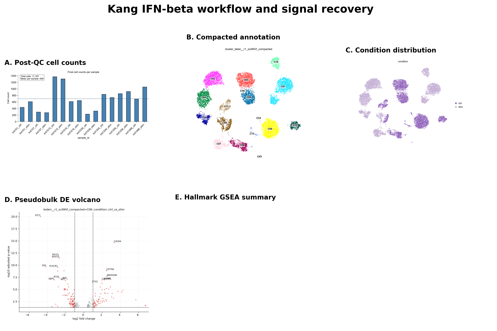
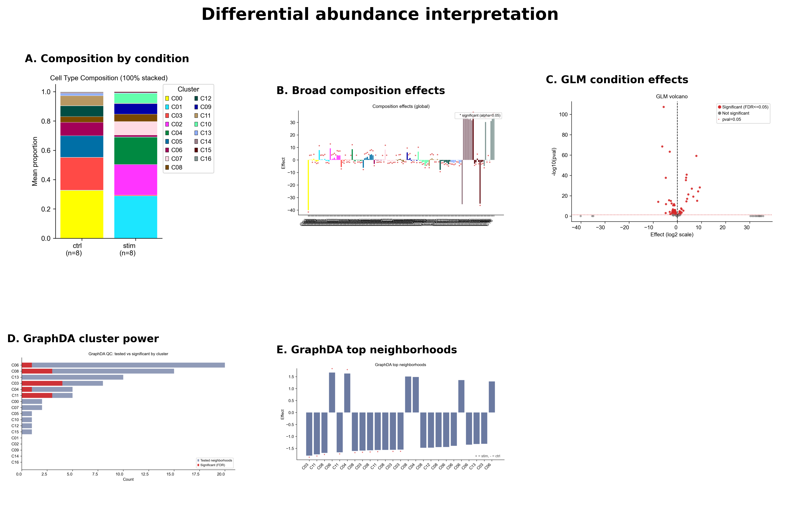
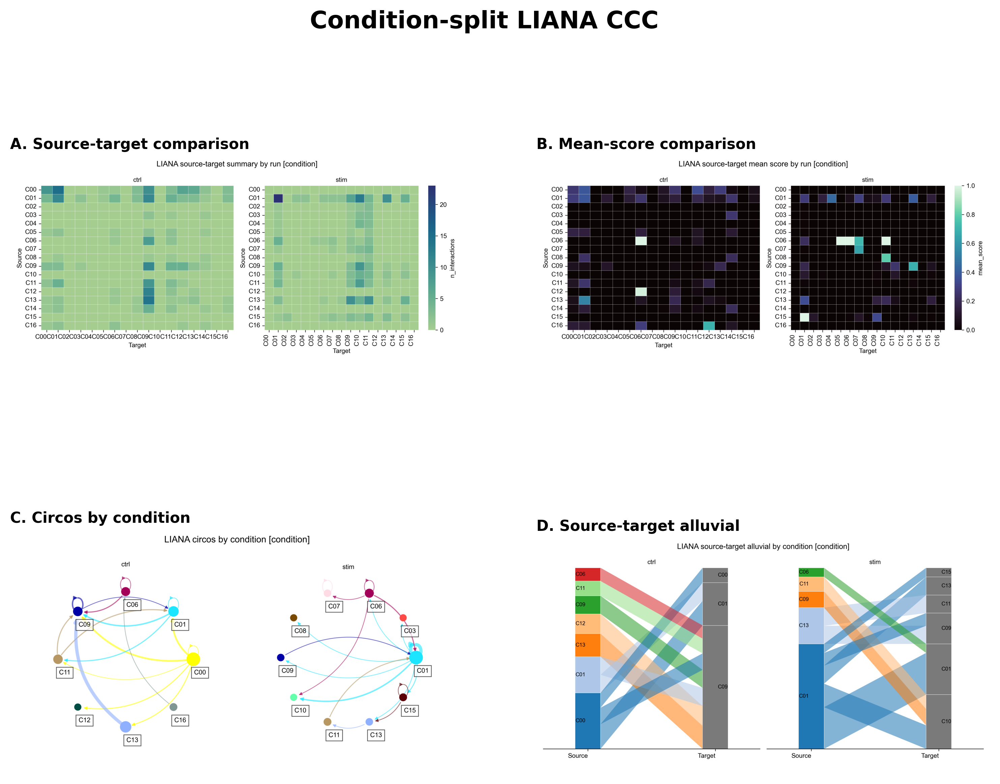

# Kang IFN-beta PBMC DE Tutorial

This tutorial demonstrates the condition-aware scOmnom workflow on the Kang IFN-beta PBMC dataset (`GSE96583`). It is the companion downstream extension to the [PBMC10k data processing tutorial](data-processing-pbmc10k.md).

The Kang tutorial covers:

* load/filter, integration, cluster/annotate, and markers;
* donor-aware `ctrl` versus `stim` DE;
* MSigDB enrichment, DoRothEA, and PROGENy activity layers;
* differential abundance with CLR, GLM, and GraphDA;
* condition-split LIANA CCC.

Use processed count matrices only for this tutorial. Do not download or stage FASTQ, BAM, FASTA, GTF, GFF, SRA, or other raw/reference sequence files.

## Kang Metadata

Validated metadata columns:

| Concept | Column | Values |
| --- | --- | --- |
| Condition | `condition` | `ctrl`, `stim` |
| Replicate | `donor_id` | 8 donors |
| Sample unit | `sample_id` | 16 donor-condition samples |
| Active round | `r1_scANVI_compacted` | compacted annotated round |

## Input Staging

The validated input was staged from GEO processed supplementary files:

* `GSE96583_RAW.tar`;
* `GSE96583_batch2.genes.tsv.gz`;
* `GSE96583_batch2.total.tsne.df.tsv.gz`.

The staging step produced 24,366 singlet cells, 35,635 genes, 8 donors, 2 conditions, and 16 donor-by-condition 10x-style sample directories.

## Load And Filter

```bash
scomnom load-and-filter \
  --filtered-sample-dir input/kang_ifnb_10x \
  --metadata-tsv input/metadata.tsv \
  --out results \
  --output-name kang_ifnb.filtered \
  --figdir-name figures \
  --batch-key sample_id \
  --n-jobs 16
```

Validated output:

* `results/kang_ifnb.filtered.zarr.tar.zst`;
* final shape: 11,187 cells x 12,428 genes;
* `condition`, `donor_id`, and `sample_id` retained in `obs`.

## Integrate

```bash
scomnom integrate \
  --input-path results/kang_ifnb.filtered.zarr.tar.zst \
  --output-dir results \
  --output-name kang_ifnb.integrated \
  --figdir-name figures \
  --batch-key donor_id \
  --benchmark-n-jobs 16
```

Validated output:

* `results/kang_ifnb.integrated.zarr.tar.zst`;
* final shape: 11,187 cells x 12,428 genes;
* `scANVI` selected as the best embedding in the local validation run.

## Cluster, Annotate, And Run Markers

```bash
scomnom cluster-and-annotate \
  --input-path results/kang_ifnb.integrated.zarr.tar.zst \
  --output-dir results \
  --output-name kang_ifnb.clustered.annotated \
  --figdir-name figures \
  --batch-key donor_id

scomnom markers-and-de markers \
  --input-path results/kang_ifnb.clustered.annotated.zarr.tar.zst \
  --output-dir results \
  --output-name kang_ifnb.markers \
  --figdir-name figures \
  --n-jobs 16
```

Validated output:

* active round: `r1_scANVI_compacted`;
* BISC selected resolution 1.4 in the local run;
* compaction reduced 18 clusters to 17 clusters;
* decoupler payloads include MSigDB, DoRothEA, and PROGENy.

## Run Donor-Aware DE And Enrichment

```bash
scomnom markers-and-de de \
  --run both \
  --input-path results/kang_ifnb.markers.zarr.tar.zst \
  --output-dir results \
  --output-name kang_ifnb.de \
  --figdir-name figures \
  --condition-keys condition \
  --replicate-key donor_id \
  --plot-sample-annotation-keys condition \
  --plot-sample-annotation-keys donor_id \
  --n-jobs 16 \
  --max-workers 16
```

Interpretation notes:

* The validated contrast convention is `ctrl_vs_stim`.
* Negative log2 fold changes, negative NES values, and negative activity scores indicate `stim`-enriched signal under that convention.
* Per-cluster donor-aware DE is limited by condition imbalance after clustering. In Snellius validation, only clusters `C06` and `C11` had enough cells in both `ctrl` and `stim`; most cluster-level contrasts were skipped for `min_cells_per_level_in_cluster`.
* This is not a failure. It is the correct statistical guard for this dataset.



Condition-aware scOmnom workflow and IFN-beta signal recovery in the Kang PBMC DE tutorial. The workflow recovers IFN-beta-associated DE and pathway signal in estimable clusters while retaining practical caveats such as skipped cluster-level contrasts when condition balance is insufficient.

## Run Differential Abundance

```bash
scomnom markers-and-de da \
  --input-path results/kang_ifnb.de.zarr.tar.zst \
  --output-dir results \
  --output-name kang_ifnb.da \
  --figdir-name figures \
  --round-id r1_scANVI_compacted \
  --condition-keys condition \
  --replicate-key donor_id \
  --n-jobs 16
```

Validated DA interpretation:

* GLM: 17 condition rows, 13 FDR-significant stim-versus-ctrl cluster effects, 0 nonfinite coefficients, and 3 warning-flagged rows.
* CLR: 16 of 17 clusters significant at FDR <= 0.05, consistent with broad IFN-beta composition shifts.
* GraphDA: 2,000 neighborhoods generated, 71 tested, and 12 significant neighborhood rows mapped to parent clusters `C03`, `C04`, `C06`, `C08`, and `C11`.
* Treat GraphDA as conservative local-neighborhood evidence, not as a replacement for broad cluster-level composition tests.



Layered differential abundance interpretation for the Kang IFN-beta PBMC tutorial. CLR and GLM support broad cluster-composition evidence, while GraphDA provides conservative local-neighborhood evidence. Warning diagnostics should remain visible in the tables and interpretation.

## Run CCC With LIANA

```bash
scomnom markers-and-de ccc liana \
  --input-path results/kang_ifnb.de.zarr.tar.zst \
  --output-dir results \
  --output-name kang_ifnb.ccc_liana \
  --figdir-name figures \
  --round-id r1_scANVI_compacted \
  --condition-key condition \
  --input-mode counts
```

Validated output:

* `results/kang_ifnb.ccc_liana.zarr.tar.zst`;
* LIANA outputs split into `ctrl` and `stim`;
* each condition writes a 250-row `liana_rank_aggregate_top.tsv`;
* full rank-aggregate, source-target, route-family, settings, and figure outputs.



Condition-split LIANA cell-cell communication analysis for the Kang IFN-beta PBMC tutorial. Source-target heatmaps, mean-score comparisons, circos summaries, and alluvial plots compare inferred communication structure between `ctrl` and `stim`.

## Expected Outcomes

The validated DE tutorial evidence supports:

* load/filter, integration, clustering, annotation, markers, DE, DA, and CCC completion;
* final filtered object with 11,187 cells and 12,428 genes;
* `scANVI` selected as the integration embedding;
* active compacted round `r1_scANVI_compacted`;
* IFN-beta biology recovered through DE genes, MSigDB GSEA, PROGENy, and DoRothEA;
* broad composition shifts identified with CLR and GLM;
* local-neighborhood shifts identified with GraphDA;
* condition-split LIANA summaries for `ctrl` and `stim`.

## Troubleshooting

| Problem | Likely cause | Recommended action |
| --- | --- | --- |
| Most per-cluster DE contrasts are skipped | Cluster is dominated by one condition or has too few cells per level | Treat the skip as a valid statistical guard; inspect condition balance and use estimable clusters for DE interpretation. |
| GLM reports fit warnings | Perfect separation or sparse sample-by-cluster counts | Keep warning-flagged rows visible and avoid over-interpreting non-significant extreme coefficients. |
| GraphDA has few significant rows | Local neighborhoods are underpowered or scale is too narrow | Inspect `graphda_diagnostics.tsv`; consider a broader graph scale in a follow-up run. |
| DoRothEA or PROGENy loading fails | Network/resource access blocked | Rerun in an environment with resource access or pre-cache resources. |
| CCC outputs look sparse | Some source-target routes are absent after condition split | Check cell counts per condition and cluster before interpreting route differences. |

---
