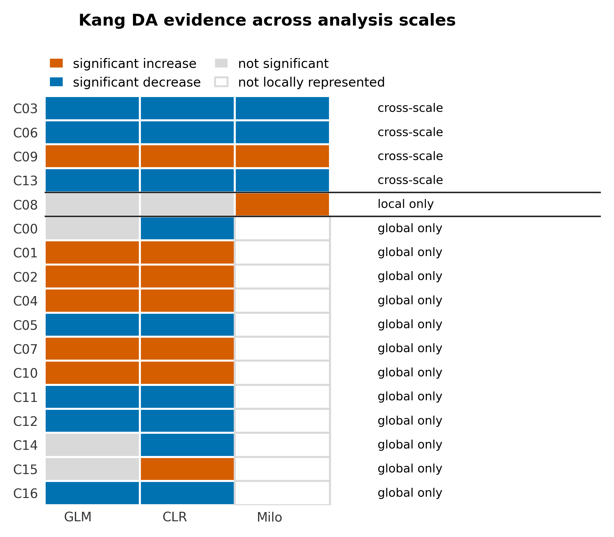
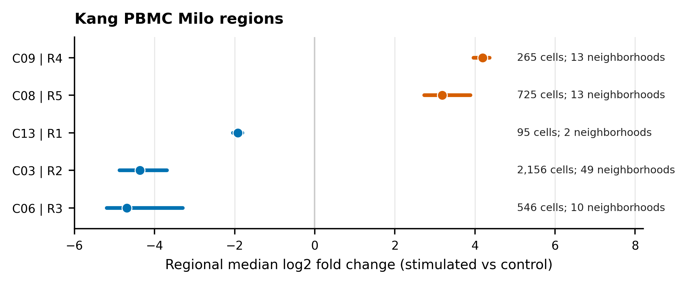

# Kang IFN-beta PBMC DE Tutorial

This tutorial demonstrates the condition-aware scOmnom workflow on the Kang IFN-beta PBMC dataset (`GSE96583`). It is the companion downstream extension to the [PBMC10k data processing tutorial](data-processing-pbmc10k.md).

The Kang tutorial covers:

* load/filter, integration, cluster/annotate, and markers;
* donor-aware `ctrl` versus `stim` DE;
* MSigDB enrichment, DoRothEA, and PROGENy activity layers;
* a pre-release example for paired sample-level activity inference (biological validation pending);
* differential abundance with CLR, GLM, and Milo;
* condition-split LIANA CCC.

Use processed count matrices only for this tutorial. Do not download or stage FASTQ, BAM, FASTA, GTF, GFF, SRA, or other raw/reference sequence files.

## Kang Metadata

Validated metadata columns:

| Concept | Column | Values |
| --- | --- | --- |
| Condition | `condition` | `ctrl`, `stim` |
| Subject / pairing covariate | `donor_id` | 8 donors |
| Replicate library | `sample_id` | 16 donor-condition samples |
| Active round | `r1_scANVI_compacted` | compacted annotated round |

## Input Staging

The validated input was staged from GEO processed supplementary files:

* `GSE96583_RAW.tar`;
* `GSE96583_batch2.genes.tsv.gz`;
* `GSE96583_batch2.total.tsne.df.tsv.gz`.

The staging step produced 24,366 singlet cells, 35,635 genes, 8 donors, 2 conditions, and 16 donor-by-condition 10x-style sample directories.

## Load And Filter

```bash
scomnom load-and-filter \
  --filtered-sample-dir input/kang_ifnb_10x \
  --metadata-tsv input/metadata.tsv \
  --out results \
  --output-name kang_ifnb.filtered \
  --figdir-name figures \
  --batch-key sample_id \
  --n-jobs 16
```

Validated output:

* `results/kang_ifnb.filtered.zarr.tar.zst`;
* final shape: 11,187 cells x 12,428 genes;
* `condition`, `donor_id`, and `sample_id` retained in `obs`.

## Integrate

```bash
scomnom integrate \
  --input-path results/kang_ifnb.filtered.zarr.tar.zst \
  --output-dir results \
  --output-name kang_ifnb.integrated \
  --figdir-name figures \
  --batch-key donor_id \
  --benchmark-n-jobs 16
```

Validated output:

* `results/kang_ifnb.integrated.zarr.tar.zst`;
* final shape: 11,187 cells x 12,428 genes;
* `scANVI` selected as the best embedding in the local validation run.

## Cluster, Annotate, And Run Markers

```bash
scomnom cluster-and-annotate \
  --input-path results/kang_ifnb.integrated.zarr.tar.zst \
  --output-dir results \
  --output-name kang_ifnb.clustered.annotated \
  --figdir-name figures \
  --batch-key donor_id

scomnom markers \
  --input-path results/kang_ifnb.clustered.annotated.zarr.tar.zst \
  --output-dir results \
  --output-name kang_ifnb.markers \
  --figdir-name figures \
  --n-jobs 16
```

Validated output:

* active round: `r1_scANVI_compacted`;
* BISC selected resolution 1.4 in the local run;
* compaction reduced 18 clusters to 17 clusters;
* decoupler payloads include MSigDB, DoRothEA, and PROGENy.

## Run Donor-Aware DE And Enrichment

```bash
scomnom de \
  --run both \
  --input-path results/kang_ifnb.markers.zarr.tar.zst \
  --output-dir results \
  --output-name kang_ifnb.de \
  --figdir-name figures \
  --condition-keys condition \
  --replicate-key sample_id \
  --pb-covariates donor_id \
  --plot-sample-annotation-keys condition \
  --plot-sample-annotation-keys donor_id \
  --n-jobs 16 \
  --max-workers 16
```

Interpretation notes:

* The validated contrast convention is `ctrl_vs_stim`.
* Negative log2 fold changes, negative NES values, and negative activity scores indicate `stim`-enriched signal under that convention.
* Pseudobulk libraries are formed per donor-condition sample and the paired DESeq2 model is `~ donor_id + condition`.
* State-cluster DE is limited by condition imbalance after clustering. The later support audit found that C06 and C08 passed the cell-level gate, while only C08 had enough 20-cell pseudobulk libraries in both conditions. These are different support checks; neither establishes complete-pair support for the new sample-activity model.
* Treat unsupported comparisons as explicit exclusions. A separate marker-reviewed broad-lineage round can answer a cross-condition lineage question while preserving the original state partition; it changes the comparison unit and must be defined before examining the new activity results.


Condition-aware scOmnom workflow and IFN-beta signal recovery in the Kang PBMC DE tutorial. The workflow recovers IFN-beta-associated DE and pathway signal in estimable clusters while retaining practical caveats such as skipped cluster-level contrasts when condition balance is insufficient.

## Paired Sample-Level Activities (Pre-release)

The three enrichment modes answer different questions:

| Command | Input to activity scoring | Interpretation |
| --- | --- | --- |
| `enrichment cluster` | Aggregated cluster or cluster-condition expression | Descriptive activity profiles for annotation; no biological-replicate inference. |
| `enrichment de` | Gene-level differential-expression statistics | Activity associated with a contrast, useful for mechanism discovery. |
| `enrichment sample` | One count pseudobulk per library and population | Library activity scores followed by donor-adjusted condition inference. |

The following example is prepared for validation; it is not part of the validated outcomes reported below. It requires a separately saved, marker-reviewed broad-lineage round named `r3_broad_cell_types` in `kang_ifnb.lineages.zarr.tar.zst`. The earlier commands in this tutorial do not create that round automatically. Use the [annotation and rename workflow](../adata-ops/rename.md) to preserve state labels and create a distinct round whose grouping actually pools the reviewed lineages; shared display names alone do not change the statistical grouping.

```bash
scomnom enrichment sample \
  --input-path results/kang_ifnb.lineages.zarr.tar.zst \
  --output-dir results/sample_enrichment \
  --output-name kang_ifnb.enrichment_sample \
  --round-id r3_broad_cell_types \
  --replicate-key sample_id \
  --condition-key condition \
  --contrast stim:ctrl \
  --covariates donor_id \
  --subject-key donor_id \
  --min-cells-per-replicate-group 20 \
  --min-complete-subjects 3 \
  --decoupler-method consensus \
  --decoupler-consensus-methods ulm,mlm,wsum \
  --plot-activity STAT1,STAT2,IRF9 \
  --figure-formats png,pdf
```

This command uses all round populations and all enabled resources. The prespecified TF names select figures only; all successfully tested activities remain in their population-resource-contrast BH family. Consensus requires at least two successful constituents, with failures recorded. Counts use the standard `counts_cb`, then `counts_raw`, then validated `X` priority and are converted to log-CPM after summation. No integration rerun is required.

`sample_id` distinguishes the two measured libraries from each donor. `donor_id` supplies the subject fixed effect and explicit pairing: the model retains complete pairs after QC, with a minimum of three subjects. The condition coefficient is estimated by OLS with HC3 standard errors and Student t inference. Inspect excluded libraries and model statuses before interpreting estimates, especially for the smallest populations.

Here **positive effects mean higher activity in `stim`** because the contrast is `stim:ctrl`. The preceding DE example uses `ctrl_vs_stim`, so reverse its sign when comparing direction. The two modes estimate different quantities; matching directions does not imply equal effect sizes or equivalent p-values.

Review `pseudobulk_qc.tsv`, `model_exclusions.tsv`, and `model_audit.tsv` alongside scores and contrasts. Sample plots show individual library scores and a separate adjusted effect/95% interval; connecting lines identify complete model-included donor pairs. Unsupported lineages remain in the QC/audit outputs. Expected interferon-associated activity is a validation hypothesis, not an observed result of this example. See the [sample command reference](../markers-and-de/enrichment.md#sample-enrichment-pre-release) for output schemas and figure regeneration.

## Run Differential Abundance

```bash
scomnom da \
  --input-path results/kang_ifnb.de.zarr.tar.zst \
  --output-dir results \
  --output-name kang_ifnb.da \
  --figdir-name figures \
  --round-id r1_scANVI_compacted \
  --condition-keys condition \
  --replicate-key sample_id \
  --covariates donor_id \
  --method glm \
  --method clr \
  --method milo \
  --milo-scale balanced \
  --n-jobs 16
```

scOmnom offers four independent DA backends: scCODA for joint Bayesian compositional inference, GLM for covariate-adjusted per-cluster effects, CLR for a simple nonparametric screen, and Milo for local changes in the integrated manifold. This validated Kang run explicitly uses GLM, CLR, and Milo. scCODA remains a full supported backend and was validated separately with the synthetic composition controls.

The balanced Milo setting uses 75 graph neighbours, 1,000 initial seeds, and a minimum neighbourhood size of 50 cells. Use `local` (30, 2,000, and 20) when fine within-population localization is the priority, or `broad` (150, 300, and 100) for diffuse shifts and greater coverage. These presets change neighbourhood geometry and sampling density; they retain the same sample-support rule, count model, spatial-FDR threshold, and region grouping.

Validated DA interpretation:

* GLM: 17 condition rows, 13 FDR-significant stim-versus-ctrl cluster effects, 0 nonfinite coefficients, and 3 warning-flagged rows.
* CLR: 16 of 17 clusters significant at FDR <= 0.05, consistent with broad IFN-beta composition shifts.
* Milo with the balanced M05 defaults retained 656 neighbourhoods, tested 90, and identified 87 significant neighbourhoods. Because neighbourhoods overlap, these calls were consolidated into five direction-concordant regions covering 3,535 unique cells (31.6% of the dataset).
* C03, C06, C09, and C13 were supported at both global and local scales. C08 had local Milo evidence only; the remaining clusters had global evidence only.
* Seventy-seven tested neighbourhoods met an effect-review trigger for an extreme effect, minimum sample support, or both. These flags retain the estimates for review; they are not additional significance calls or automatic exclusions.
* Interpret `composition_milo_regions.tsv`, `composition_milo_region_sample_counts.tsv`, and `milo_coverage.tsv` before using raw neighbourhood effects. Milo regions provide local evidence alongside, rather than as a replacement for, broad cluster-level composition tests.



Agreement between global cluster-level GLM and CLR analyses and local Milo regions. Colors encode effect direction and significance within each method; effect magnitudes are not compared across methods. White Milo cells indicate clusters without a representative significant local region.



Grouped Milo regions from the stimulated-versus-control contrast. Points show regional median log2 fold changes, horizontal lines show interquartile ranges across constituent neighbourhoods, and labels report unique-cell and neighbourhood counts. Overlapping neighbourhoods are not independent biological findings.

## Run CCC With LIANA

```bash
scomnom ccc liana \
  --input-path results/kang_ifnb.de.zarr.tar.zst \
  --output-dir results \
  --output-name kang_ifnb.ccc_liana \
  --figdir-name figures \
  --round-id r1_scANVI_compacted \
  --condition-key condition \
  --input-mode lognorm
```

Validated output:

* `results/kang_ifnb.ccc_liana.zarr.tar.zst`;
* LIANA outputs split into `ctrl` and `stim`;
* each condition writes a 250-row `liana_rank_aggregate_top.tsv`;
* full rank-aggregate, source-target, route-family, settings, and figure outputs.


Condition-split LIANA cell-cell communication analysis for the Kang IFN-beta PBMC tutorial. Source-target heatmaps, mean-score comparisons, circos summaries, and alluvial plots compare inferred communication structure between `ctrl` and `stim`. LIANA uses a library-normalized log1p layer derived from the preferred count assay. Route-family tables distinguish CellChatDB-backed assignments from descriptive heuristic labels.

## Expected Outcomes

Sample-level activity validation is pending and is not included in these results.

The validated DE tutorial evidence supports:

* load/filter, integration, clustering, annotation, markers, DE, DA, and CCC completion;
* final filtered object with 11,187 cells and 12,428 genes;
* `scANVI` selected as the integration embedding;
* active compacted round `r1_scANVI_compacted`;
* IFN-beta biology recovered through DE genes, MSigDB GSEA, PROGENy, and DoRothEA;
* broad composition shifts identified with CLR and GLM;
* five grouped Milo regions, including four clusters with concordant global and local evidence and one cluster with local-only evidence;
* condition-split LIANA summaries for `ctrl` and `stim`.

## Troubleshooting

| Problem | Likely cause | Recommended action |
| --- | --- | --- |
| Most per-cluster DE contrasts are skipped | Cluster is dominated by one condition or has too few cells per level | Treat the skip as a valid statistical guard; inspect condition balance and use estimable clusters for DE interpretation. |
| GLM reports fit warnings | Perfect separation or sparse sample-by-cluster counts | Keep warning-flagged rows visible and avoid over-interpreting non-significant extreme coefficients. |
| Milo has few significant rows | Local neighbourhoods are underpowered or scale is too narrow | Inspect `milo_diagnostics.tsv`; consider a broader Milo scale in a follow-up run. |
| Milo covers a large fraction of cells or shows extreme effects | Overlapping neighbourhoods, broad compositional imbalance, or sparse counts can exaggerate the apparent scope | Inspect grouped regions, `milo_coverage.tsv`, review flags, and zero-inclusive sample-level region counts; compare with CLR/scCODA before making a broad claim. |
| DoRothEA or PROGENy loading fails | Network/resource access blocked | Rerun in an environment with resource access or pre-cache resources. |
| CCC outputs look sparse | Some source-target routes are absent after condition split | Check cell counts per condition and cluster before interpreting route differences. |

---
