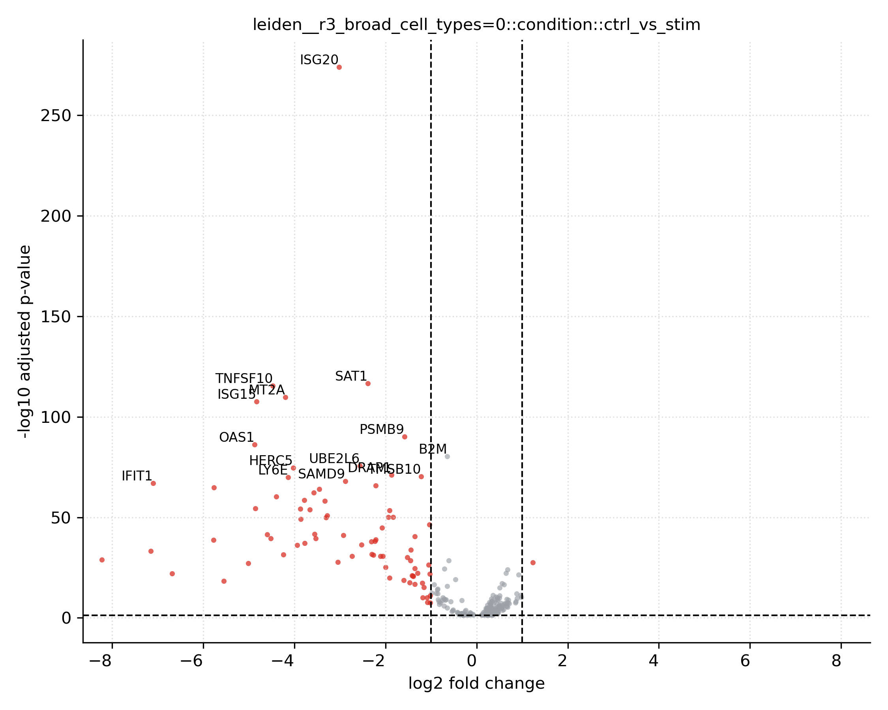
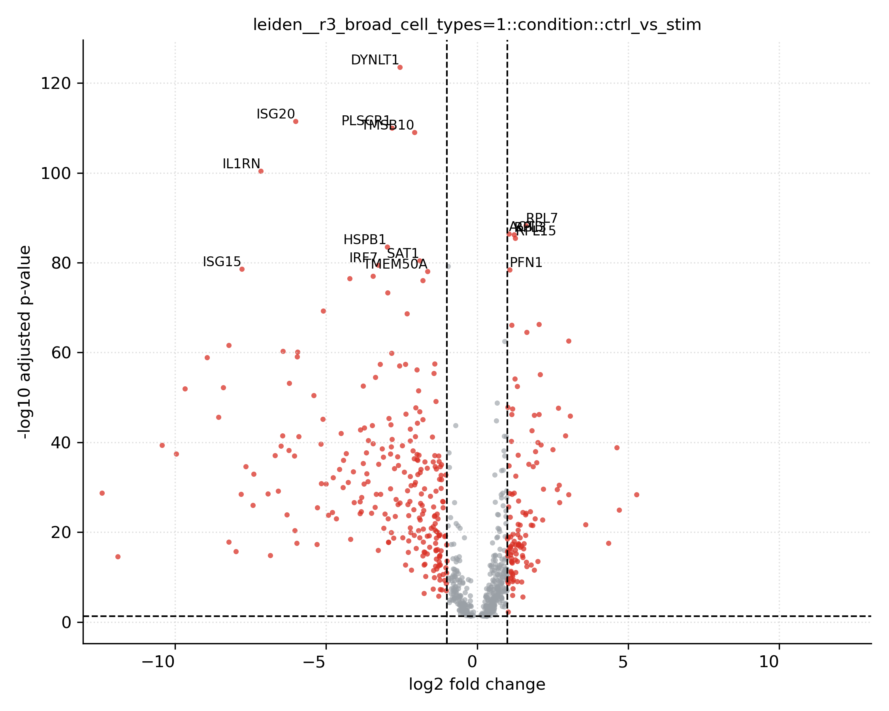
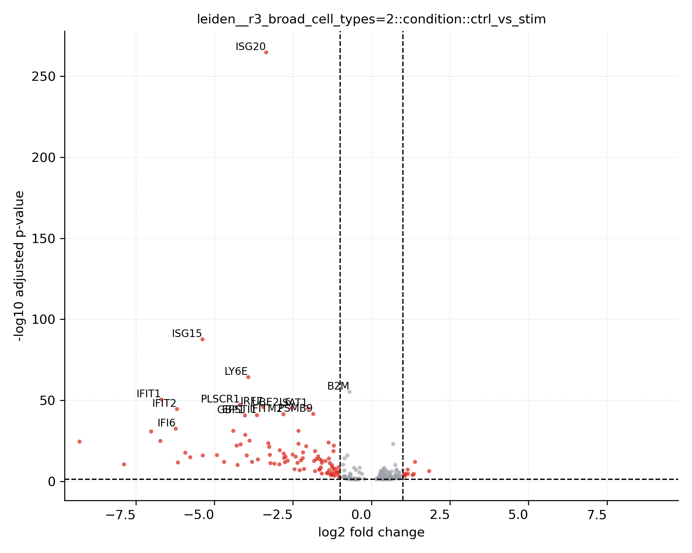
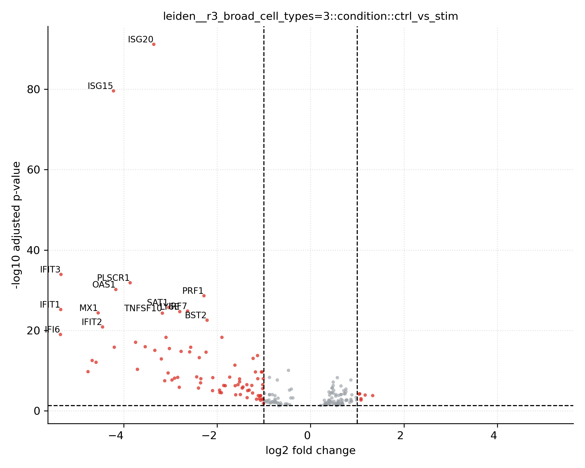
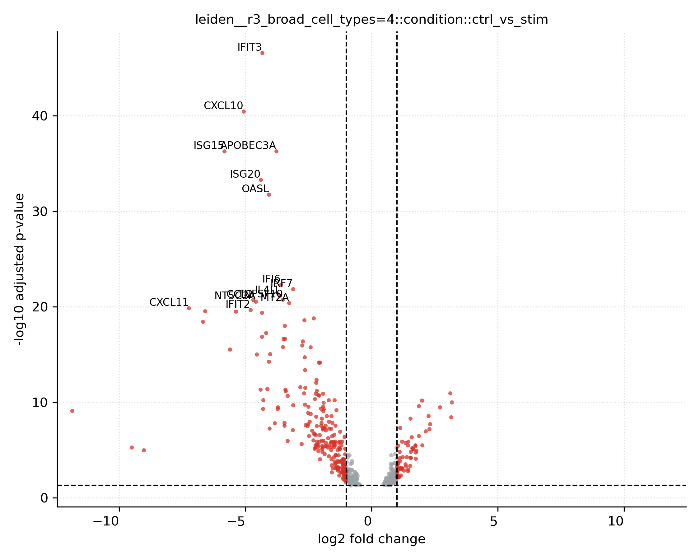
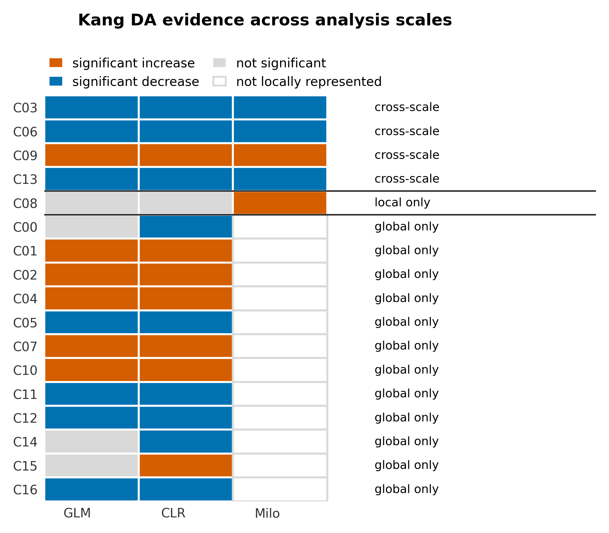
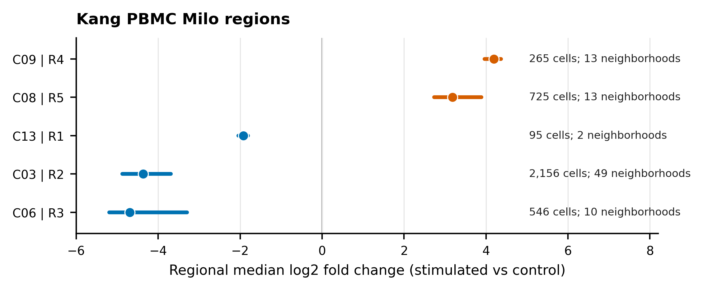
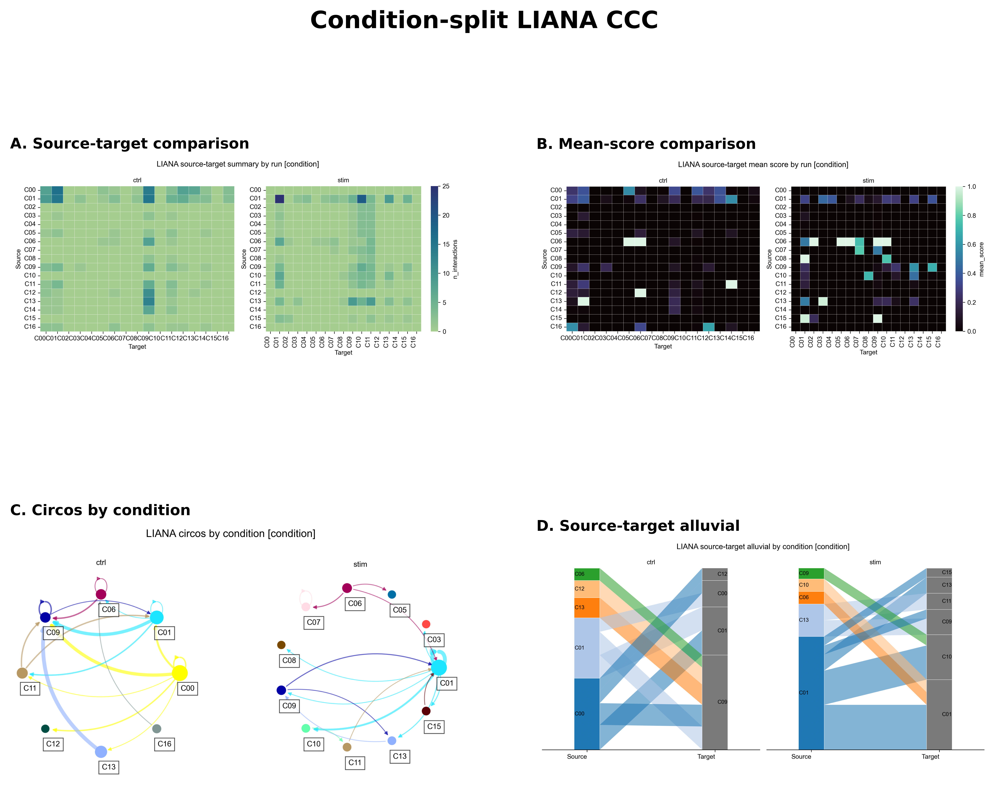

# Kang IFN-beta PBMC DE Tutorial

This tutorial demonstrates the condition-aware scOmnom workflow on the Kang IFN-beta PBMC dataset (`GSE96583`). It is the companion downstream extension to the [PBMC10k data processing tutorial](data-processing-pbmc10k.md).

The Kang tutorial covers:

* load/filter, integration, cluster/annotate, and markers;
* donor-aware `ctrl` versus `stim` DE;
* MSigDB enrichment, DoRothEA, and PROGENy activity layers;
* a paired sample-level activity example validated separately on a reviewed broad-lineage round;
* differential abundance with CLR, GLM, and Milo;
* condition-split LIANA CCC.

Use processed count matrices only for this tutorial. Do not download or stage FASTQ, BAM, FASTA, GTF, GFF, SRA, or other raw/reference sequence files.

## Software Version And Evidence

The command reference is scOmnom **0.9.0rc1**, tag `v0.9.0rc1`, commit `607f4ce3369be13072b179b08254954200954394`. Use the [release instructions](https://github.com/prangelab/scOmnom/releases/tag/v0.9.0rc1) with the [platform-specific environment guide](../installation.md). The figures and numerical outcomes come from recorded validation runs with their own commits, including separately reviewed downstream and sample-enrichment runs; they are not claimed as a new end-to-end execution of this candidate.

## Kang Metadata

Validated metadata columns:

| Concept | Column | Values |
| --- | --- | --- |
| Condition | `condition` | `ctrl`, `stim` |
| Subject / pairing covariate | `donor_id` | 8 donors |
| Replicate library | `sample_id` | 16 donor-condition samples |
| Active round | `r1_scANVI_compacted` | compacted annotated round |

## Input Staging

Use the [Kang staging helper](code/prepare_kang_input.py) in the installed scOmnom environment. Place it in `code/` in your tutorial working directory, then run:

```bash
python code/prepare_kang_input.py \
  --source-dir source_geo \
  --output-dir input \
  --download
```

The helper downloads only these three [GEO supplementary files](https://ftp.ncbi.nlm.nih.gov/geo/series/GSE96nnn/GSE96583/suppl/), approximately 77 MB in total, and verifies their pinned byte counts and SHA256 checksums:

* `GSE96583_RAW.tar`;
* `GSE96583_batch2.genes.tsv.gz`;
* `GSE96583_batch2.total.tsne.df.tsv.gz`.

`RAW.tar` is the GEO archive name, not an instruction to use raw-droplet input mode. Its contents are processed matrices and barcode lists, not sequencing reads. The helper uses only the two batch-2 control/stimulation matrices and splits their metadata-matched singlets into donor-condition samples. No CellBender processing, extra QC, normalization, or gene filtering is applied during staging. Use the **filtered** input mode below.

The staged input contains **24,366 singlets, 35,635 genes, 8 donors, 2 conditions, and 16 donor-condition directories**. Its integer-count total is **38,116,097**, with **13,990,043 nonzero entries**.

| Output | Contents |
| --- | --- |
| `input/kang_ifnb_10x/` | Sixteen `*.filtered_feature_bc_matrix` directories, each containing `matrix.mtx.gz`, `features.tsv.gz`, and `barcodes.tsv.gz`. |
| `input/metadata.tsv` | Sample identifiers, donor, condition, and basic study metadata for `load-and-filter`. |
| `input/cell_identity.tsv` | Barcode-to-sample identities for checking the split; not an annotation input. |
| `input/sample_counts.tsv` | Cell, count, and nonzero totals per donor-condition sample. |
| `input/barcode_join_exclusions.tsv` | Unmatched barcodes on both sides of the source-data join. |
| `input/staging_manifest.json` | Source URLs/checksums, selection counts, and output checksums. |

There is a barcode discrepancy in the published stimulated data: 313 metadata entries and 313 matrix barcodes have no exact counterpart in the other file. The helper retains the exact barcode intersection used in the validated analysis; it does not guess suffix corrections. Of the matched cells, 12,315 control and 12,051 stimulated cells are annotated as singlets and retained. Published cell-type labels, clustering labels, and t-SNE coordinates are not exported into the analysis metadata. Author singlet calls are used for this initial selection; the subsequent scOmnom QC and doublet settings remain unchanged.

The output directory must not already exist. The helper does not overwrite previous inputs. Verified source files can be reused offline by omitting `--download` and choosing a new output directory. A changed checksum or unexpected barcode-join count stops staging. No package installation or download of FASTQ/BAM/reference files is performed.

## Load And Filter

```bash
scomnom load-and-filter \
  --filtered-sample-dir input/kang_ifnb_10x \
  --metadata-tsv input/metadata.tsv \
  --out results \
  --output-name kang_ifnb.filtered \
  --figdir-name figures \
  --batch-key sample_id \
  --n-jobs 16
```

Validated output:

* `results/kang_ifnb.filtered.zarr.tar.zst`;
* final shape: 11,187 cells x 12,428 genes;
* `condition`, `donor_id`, and `sample_id` retained in `obs`.

## Integrate

```bash
scomnom integrate \
  --input-path results/kang_ifnb.filtered.zarr.tar.zst \
  --output-dir results \
  --output-name kang_ifnb.integrated \
  --figdir-name figures \
  --batch-key donor_id \
  --benchmark-n-jobs 16
```

Validated output:

* `results/kang_ifnb.integrated.zarr.tar.zst`;
* final shape: 11,187 cells x 12,428 genes;
* `scANVI` selected as the best embedding in the local validation run.

## Cluster, Annotate, And Run Markers

```bash
scomnom cluster-and-annotate \
  --input-path results/kang_ifnb.integrated.zarr.tar.zst \
  --output-dir results \
  --output-name kang_ifnb.clustered.annotated \
  --figdir-name figures \
  --batch-key donor_id

scomnom markers \
  --input-path results/kang_ifnb.clustered.annotated.zarr.tar.zst \
  --output-dir results \
  --output-name kang_ifnb.markers \
  --figdir-name figures \
  --n-jobs 16
```

Validated output:

* active round: `r1_scANVI_compacted`;
* BISC selected resolution 1.4 in the local run;
* compaction reduced 18 clusters to 17 clusters;
* decoupler payloads include MSigDB, DoRothEA, and PROGENy.

## Run Donor-Aware DE And Enrichment

```bash
scomnom de \
  --run both \
  --input-path results/kang_ifnb.markers.zarr.tar.zst \
  --output-dir results \
  --output-name kang_ifnb.de \
  --figdir-name figures \
  --condition-keys condition \
  --replicate-key sample_id \
  --pb-covariates donor_id \
  --plot-sample-annotation-keys condition \
  --plot-sample-annotation-keys donor_id \
  --n-jobs 16 \
  --max-workers 16
```

Interpretation notes:

* The validated contrast convention is `ctrl_vs_stim`.
* Negative log2 fold changes, negative NES values, and negative activity scores indicate `stim`-enriched signal under that convention.
* Pseudobulk libraries are formed per donor-condition sample and the paired DESeq2 model is `~ donor_id + condition`.
* State-cluster DE is limited by condition imbalance after clustering. The later support audit found that C06 and C08 passed the cell-level gate, while only C08 had enough 20-cell pseudobulk libraries in both conditions. These are different support checks; neither establishes complete-pair support for the new sample-activity model.
* Treat unsupported comparisons as explicit exclusions. A separate marker-reviewed broad-lineage round can answer a cross-condition lineage question while preserving the original state partition; it changes the comparison unit and must be defined before examining the new activity results.

## Reviewed Broad-Lineage DE

Stimulation can separate cells of the same broad identity into different transcriptional states. A second annotation layer allows a cross-condition comparison within broad cell types while preserving the original states for other analyses. The reviewed Kang mapping pools the 17 states into seven broad identities; five have sufficient donor-condition support for DE.

### Define The Annotation Layers

Review the marker results before pooling identities. The [manual annotation workflow](../adata-ops/rename.md) first assigns broad names while retaining every state, then creates a second layer that pools states with the same reviewed name. Assigning identical display names alone does not pool statistical groups.

The [reviewed Kang mapping](code/kang_state_to_lineage.tsv) contains two tab-delimited columns without a header. It applies only to the frozen 17-state partition used here. Cluster codes are not transferable identities: a fresh clustering can assign the same code to different cells. For a fresh run, create `input/state_to_lineage.tsv` from its own marker review.

Use the [annotation preflight](code/check_kang_annotation_input.py) to compare `counts_raw` against the filtered checkpoint, verify sample metadata, and check that the mapping covers every state exactly once. Place the helper in `code/` in your tutorial working directory. For a mapping you reviewed on your own clustering:

```bash
python code/check_kang_annotation_input.py \
  --input results/kang_ifnb.clustered.annotated.zarr.tar.zst \
  --filtered results/kang_ifnb.filtered.zarr.tar.zst \
  --mapping input/state_to_lineage.tsv \
  --round-id r1_scANVI_compacted \
  --reviewed-mapping \
  --report results/annotation_preflight.json
```

For the frozen mapping supplied above, use its [partition reference](code/kang_annotation_reference.json) and replace `--reviewed-mapping` with `--frozen-reference input/kang_annotation_reference.json`. This checks the exact cell-to-state assignments, not merely the number or names of the clusters. A mismatch requires a new marker review. The helper is read-only and never repairs or rounds a count matrix. Stop if any check fails.

Create both layers after the preflight succeeds:

```bash
scomnom adata-ops rename \
  --input-path results/kang_ifnb.clustered.annotated.zarr.tar.zst \
  --output-dir results \
  --output-name kang_ifnb.curated_states \
  --rename-idents-file input/state_to_lineage.tsv \
  --round-id r1_scANVI_compacted \
  --rename-round-name curated_states \
  --no-collapse-same-labels \
  --no-set-active

scomnom adata-ops rename \
  --input-path results/kang_ifnb.curated_states.zarr.tar.zst \
  --output-dir results \
  --output-name kang_ifnb.lineages \
  --rename-idents-file input/state_to_lineage.tsv \
  --round-id r2_curated_states \
  --rename-round-name broad_cell_types \
  --collapse-same-labels \
  --no-set-active
```

For the frozen example, the first step retains 17 states in `r2_curated_states`; the second creates seven broad groups in `r3_broad_cell_types`. Both retain the original active round, count layers, and embedding. The broad object is saved separately as `results/kang_ifnb.lineages.zarr.tar.zst`. If you already added other rounds, use the actual identifiers reported in the log in subsequent commands. The original state-level DE, DA, and CCC commands continue to use their original objects.

### Compare Broad Cell Types

```bash
scomnom de \
  --input-path results/kang_ifnb.lineages.zarr.tar.zst \
  --output-dir results/lineage_de \
  --output-name kang_ifnb.de_lineages \
  --round-id r3_broad_cell_types \
  --run pseudobulk \
  --condition-keys condition \
  --contrasts ctrl_vs_stim \
  --replicate-key sample_id \
  --pb-covariates donor_id \
  --pb-counts-layer counts_raw \
  --pb-store-key scomnom_de_restored_counts \
  --de-decoupler-source pseudobulk \
  --n-jobs 4 \
  --max-workers 4 \
  --no-prune-uns-de \
  --figure-formats png \
  --figure-formats pdf
```

The displayed results were generated at commit `a10cad430214d10784435a4e25b29d5e3feb31fb` from verified integer counts and the frozen reviewed mapping. They are separate from the earlier state-level DE results and are not a new end-to-end release-candidate execution. The historical archive required restoring `counts_raw` from the verified filtered checkpoint; do not treat normalized values as counts or attempt to repair them by rounding. A fresh analysis should preserve the original counts throughout.

| Broad identity | Available complete donor pairs | Tested genes | Genes with FDR < 0.05 |
| --- | ---: | ---: | ---: |
| T cells | 8 | 537 | 275 |
| CD14+ monocytes | 8 | 922 | 778 |
| B cells | 7 | 615 | 225 |
| NK-enriched cytotoxic lymphocytes | 6 | 540 | 203 |
| FCGR3A+ monocytes | 4 | 1,035 | 475 |

The model uses eligible donor-condition libraries with donor adjustment; the available complete-pair counts describe support, not an explicit complete-pair-only filter. Dendritic and unresolved myeloid identities lacked supported fits and are not interpreted as null results. All eight prespecified IFN-response genes (`IFIT1`, `IFIT2`, `IFIT3`, `IFI44L`, `MX1`, `IFI6`, `ISG15`, `IRF7`) were stimulation-associated and FDR-significant in all five supported identities.

The following plots are unmodified native scOmnom outputs. Their numeric identifiers refer to the broad-identity round, not the original state codes. Negative effects indicate higher expression after stimulation. Red points meet both **FDR < 0.05 and absolute shrunk log2 fold change > 1**; the table above counts FDR alone.



T cells, broad population 0. [Vector PDF](panels/kang_de_t_cells.pdf).



CD14+ monocytes, broad population 1. [Vector PDF](panels/kang_de_cd14_monocytes.pdf).



B cells, broad population 2. [Vector PDF](panels/kang_de_b_cells.pdf).



NK-enriched cytotoxic lymphocytes, broad population 3. [Vector PDF](panels/kang_de_nk_enriched.pdf).



FCGR3A+ monocytes, broad population 4. [Vector PDF](panels/kang_de_fcgr3a_monocytes.pdf).

The associated enrichment outputs recovered stimulation-oriented interferon signals. Their logs record exclusion of the singular MSigDB MLM constituent and substantial ties in GSEA ranking statistics; inspect these diagnostics and do not interpret exported zero GSEA adjusted p-values as exact zero. These pathway summaries and gene-level DE have different statistics. DA and CCC below continue to use the original state round and its output archive.

## Paired Sample-Level Activities

The three enrichment modes answer different questions:

| Command | Input to activity scoring | Interpretation |
| --- | --- | --- |
| `enrichment cluster` | Aggregated cluster or cluster-condition expression | Descriptive activity profiles for annotation; no biological-replicate inference. |
| `enrichment de` | Gene-level differential-expression statistics | Activity associated with a contrast, useful for mechanism discovery. |
| `enrichment sample` | One count pseudobulk per library and population | Library activity scores followed by donor-adjusted condition inference. |

This separately validated example uses the same count-verified `kang_ifnb.lineages.zarr.tar.zst` input and `r3_broad_cell_types` round described above. It scores library-level expression directly, not the preceding DE table. Create the broad-lineage object with the two annotation steps above before running this extension.

```bash
scomnom enrichment sample \
  --input-path results/kang_ifnb.lineages.zarr.tar.zst \
  --output-dir results/sample_enrichment \
  --output-name kang_ifnb.enrichment_sample \
  --round-id r3_broad_cell_types \
  --replicate-key sample_id \
  --condition-key condition \
  --contrast stim:ctrl \
  --covariates donor_id \
  --subject-key donor_id \
  --min-cells-per-replicate-group 20 \
  --min-complete-subjects 3 \
  --decoupler-method consensus \
  --decoupler-consensus-methods ulm,mlm,wsum \
  --plot-activity STAT1,STAT2,IRF9 \
  --figure-formats png,pdf
```

This command uses all round populations and all enabled resources. The prespecified TF names select figures only; all successfully tested activities remain in their population-resource-contrast BH family. Consensus requires at least two successful constituents, with failures recorded. Counts use the standard `counts_cb`, then `counts_raw`, then validated `X` priority and are converted to log-CPM after summation. No integration rerun is required.

`sample_id` distinguishes the two measured libraries from each donor. `donor_id` supplies the subject fixed effect and explicit pairing: the model retains complete pairs after QC, with a minimum of three subjects. The condition coefficient is estimated by OLS with HC3 standard errors and Student t inference. Inspect excluded libraries and model statuses before interpreting estimates, especially for the smallest populations.

Here **positive effects mean higher activity in `stim`** because the contrast is `stim:ctrl`. The preceding DE example uses `ctrl_vs_stim`, so reverse its sign when comparing direction. The two modes estimate different quantities; matching directions does not imply equal effect sizes or equivalent p-values.

Review `pseudobulk_qc.tsv`, `model_exclusions.tsv`, and `model_audit.tsv` alongside scores and contrasts. Sample plots show individual library scores and a separate adjusted effect/95% interval; connecting lines identify complete model-included donor pairs. Unsupported lineages remain in the QC/audit outputs. The separately reviewed Kang validation found positive interferon-associated effects in five supported broad lineages; that result is not generated by this tutorial example. See the [sample command reference](../markers-and-de/enrichment.md#sample-enrichment) for output schemas and figure regeneration.

## Run Differential Abundance

```bash
scomnom da \
  --input-path results/kang_ifnb.de.zarr.tar.zst \
  --output-dir results \
  --output-name kang_ifnb.da \
  --figdir-name figures \
  --round-id r1_scANVI_compacted \
  --condition-keys condition \
  --replicate-key sample_id \
  --covariates donor_id \
  --method glm \
  --method clr \
  --method milo \
  --milo-scale balanced \
  --n-jobs 16
```

scOmnom offers four independent DA backends: scCODA for joint Bayesian compositional inference, GLM for covariate-adjusted per-cluster effects, CLR for a simple nonparametric screen, and Milo for local changes in the integrated manifold. This validated Kang run explicitly uses GLM, CLR, and Milo. scCODA remains a full supported backend and was validated separately with the synthetic composition controls.

The balanced Milo setting uses 75 graph neighbours, 1,000 initial seeds, and a minimum neighbourhood size of 50 cells. Use `local` (30, 2,000, and 20) when fine within-population localization is the priority, or `broad` (150, 300, and 100) for diffuse shifts and greater coverage. These presets change neighbourhood geometry and sampling density; they retain the same sample-support rule, count model, spatial-FDR threshold, and region grouping.

Validated DA interpretation:

* GLM: 17 condition rows, 13 FDR-significant stim-versus-ctrl cluster effects, 0 nonfinite coefficients, and 3 warning-flagged rows.
* CLR: 16 of 17 clusters significant at FDR <= 0.05, consistent with broad IFN-beta composition shifts.
* Milo with the balanced M05 defaults retained 656 neighbourhoods, tested 90, and identified 87 significant neighbourhoods. Because neighbourhoods overlap, these calls were consolidated into five direction-concordant regions covering 3,535 unique cells (31.6% of the dataset).
* C03, C06, C09, and C13 were supported at both global and local scales. C08 had local Milo evidence only; the remaining clusters had global evidence only.
* Seventy-seven tested neighbourhoods met an effect-review trigger for an extreme effect, minimum sample support, or both. These flags retain the estimates for review; they are not additional significance calls or automatic exclusions.
* Interpret `composition_milo_regions.tsv`, `composition_milo_region_sample_counts.tsv`, and `milo_coverage.tsv` before using raw neighbourhood effects. Milo regions provide local evidence alongside, rather than as a replacement for, broad cluster-level composition tests.



Agreement between global cluster-level GLM and CLR analyses and local Milo regions. Colors encode effect direction and significance within each method; effect magnitudes are not compared across methods. White Milo cells indicate clusters without a representative significant local region.



Grouped Milo regions from the stimulated-versus-control contrast. Points show regional median log2 fold changes, horizontal lines show interquartile ranges across constituent neighbourhoods, and labels report unique-cell and neighbourhood counts. Overlapping neighbourhoods are not independent biological findings.

## Run CCC With LIANA

```bash
scomnom ccc liana \
  --input-path results/kang_ifnb.de.zarr.tar.zst \
  --output-dir results \
  --output-name kang_ifnb.ccc_liana \
  --figdir-name figures \
  --round-id r1_scANVI_compacted \
  --condition-key condition \
  --input-mode lognorm
```

Validated output:

* `results/kang_ifnb.ccc_liana.zarr.tar.zst`;
* LIANA outputs split into `ctrl` and `stim`;
* each condition writes a 250-row `liana_rank_aggregate_top.tsv`;
* full rank-aggregate, source-target, route-family, settings, and figure outputs.



Condition-split LIANA cell-cell communication analysis for the Kang IFN-beta PBMC tutorial. Source-target heatmaps, mean-score comparisons, circos summaries, and alluvial plots compare inferred communication structure between `ctrl` and `stim`. LIANA uses a library-normalized log1p layer derived from the preferred count assay. Route-family tables distinguish CellChatDB-backed assignments from descriptive heuristic labels.

## Expected Outcomes

The separately reviewed sample-level activity validation found stimulation-positive interferon-associated effects for all 25 prespecified activity-by-lineage comparisons across five supported broad lineages, with 15 discoveries after full-family FDR correction. Support differed by lineage, and the pooled perturbation and capture effects could not be separated. These results require the marker-reviewed broad-lineage round described above; they are not produced by the preceding tutorial command chain.

The validated DE tutorial evidence supports:

* load/filter, integration, clustering, annotation, markers, DE, DA, and CCC completion;
* final filtered object with 11,187 cells and 12,428 genes;
* `scANVI` selected as the integration embedding;
* active compacted round `r1_scANVI_compacted`;
* IFN-beta biology recovered through DE genes, MSigDB GSEA, PROGENy, and DoRothEA;
* broad composition shifts identified with CLR and GLM;
* five grouped Milo regions, including four clusters with concordant global and local evidence and one cluster with local-only evidence;
* condition-split LIANA summaries for `ctrl` and `stim`.

## Troubleshooting

| Problem | Likely cause | Recommended action |
| --- | --- | --- |
| Most per-cluster DE contrasts are skipped | Cluster is dominated by one condition or has too few cells per level | Treat the skip as a valid statistical guard; inspect condition balance and use estimable clusters for DE interpretation. |
| GLM reports fit warnings | Perfect separation or sparse sample-by-cluster counts | Keep warning-flagged rows visible and avoid over-interpreting non-significant extreme coefficients. |
| Milo has few significant rows | Local neighbourhoods are underpowered or scale is too narrow | Inspect `milo_diagnostics.tsv`; consider a broader Milo scale in a follow-up run. |
| Milo covers a large fraction of cells or shows extreme effects | Overlapping neighbourhoods, broad compositional imbalance, or sparse counts can exaggerate the apparent scope | Inspect grouped regions, `milo_coverage.tsv`, review flags, and zero-inclusive sample-level region counts; compare with CLR/scCODA before making a broad claim. |
| DoRothEA or PROGENy loading fails | Network/resource access blocked | Rerun in an environment with resource access or pre-cache resources. |
| CCC outputs look sparse | Some source-target routes are absent after condition split | Check cell counts per condition and cluster before interpreting route differences. |

---
